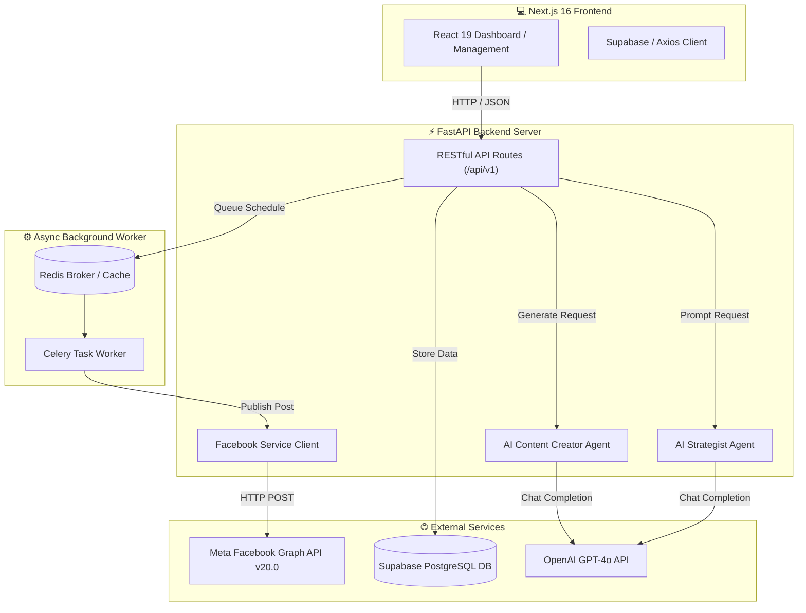

<div align="center">

  # 💙 Facebook Auto-Post 🚀

  **Hệ thống quản lý, sáng tạo nội dung AI & tự động hóa đăng bài Facebook Page chuyên nghiệp**

  [](https://developers.facebook.com/)
  [](https://fastapi.tiangolo.com/)
  [](https://nextjs.org/)
  [](https://openai.com/)
  [](https://supabase.com/)
  [](https://docs.celeryq.dev/)
  [](LICENSE)

  <p align="center">
    <a href="#-giới-thiệu-tổng-quan">Giới thiệu</a> •
    <a href="#-tính-năng-nổi-bật">Tính năng</a> •
    <a href="#%EF%B8%8F-kiến-trúc-hệ-thống">Kiến trúc</a> •
    <a href="#-công-nghệ-sử-dụng">Tech Stack</a> •
    <a href="#-hướng-dẫn-cài-đặt">Cài đặt</a> •
    <a href="#-cấu-hình-facebook-graph-api">Graph API</a> •
    <a href="#-api-endpoints">API Docs</a>
  </p>

</div>

---

## 🌐 Giới thiệu tổng quan

**Facebook Auto-Post** là giải pháp toàn diện giúp các Doanh nghiệp, Agency Marketing và Content Creator tối ưu hóa quy trình quản lý Fanpage. 

Hệ thống kết hợp trí tuệ nhân tạo **OpenAI GPT-4o** để phân tích đối tượng mục tiêu, tự động lên chiến lược nội dung (Content Pillars), tạo bài viết bắt mắt (kèm Hook, CTA, Emoji & Hashtag) và tự động xuất bản bài đăng trực tiếp lên Facebook Pages thông qua **Meta Graph API v20.0** kết hợp với **Celery Task Queue**.

---

## ✨ Tính năng nổi bật

<table>
  <tr>
    <td width="50%">
      <h3>🤖 AI Content Strategist</h3>
      <ul>
        <li>Phân tích mục tiêu kinh doanh & nhóm khách hàng tiềm năng.</li>
        <li>Đề xuất 3 chủ đề cột trụ (Content Pillars) hiệu quả nhất.</li>
        <li>Gợi ý khung giờ vàng & tần suất đăng bài tối ưu tương tác.</li>
      </ul>
    </td>
    <td width="50%">
      <h3>✍️ AI Copywriter Engine</h3>
      <ul>
        <li>Tạo bài đăng Facebook đa dạng giọng văn (Professional, Viral, Casual,...).</li>
        <li>Cấu trúc bài viết chuẩn Marketing: <i>Hook lôi cuốn ➔ Nội dung chính ➔ Call to Action ➔ Hashtag</i>.</li>
        <li>Tự động chọn lọc & gợi ý Emoji cùng hình ảnh minh họa phù hợp.</li>
      </ul>
    </td>
  </tr>
  <tr>
    <td width="50%">
      <h3>📅 Lịch đăng bài tự động (Smart Scheduler)</h3>
      <ul>
        <li>Lên lịch xuất bản bài viết chính xác theo thời gian thực.</li>
        <li>Quản lý trạng thái vòng đời bài đăng: <code>draft</code>, <code>scheduled</code>, <code>published</code>, <code>failed</code>.</li>
        <li>Tự động xử lý ngầm (Background Worker) qua <b>Celery & Redis</b>.</li>
      </ul>
    </td>
    <td width="50%">
      <h3>📲 Facebook Pages Hub</h3>
      <ul>
        <li>Kết nối và quản lý nhiều Facebook Fanpage cùng lúc.</li>
        <li>Đăng tải bài viết tự động (Text & Photo Posts) qua Facebook Graph API.</li>
        <li>Đồng bộ chỉ số theo dõi (Followers, Page Name, Avatar) theo thời gian thực.</li>
      </ul>
    </td>
  </tr>
</table>

---

## 🏗️ Kiến trúc hệ thống



---

## 🛠️ Công nghệ sử dụng

| Tầng phát triển | Công nghệ / Thư viện | Mô tả |
| :--- | :--- | :--- |
| **Frontend** |   | Giao diện Single Page App hiện đại, hỗ trợ SSR & Dark/Light Mode. |
| **Styling** |   | Thiết kế chuẩn UI/UX linh hoạt, component mượt mà. |
| **Backend** |   | RESTful Async Server tốc độ cao, validation bằng Pydantic. |
| **AI Agent Core** |  | Mô hình ngôn ngữ lớn chuyên sâu phân tích chiến lược & viết bài. |
| **Social API** |  | Tương tác trực tiếp với Meta Graph API để đẩy bài và lấy thông tin Page. |
| **Task Queue** |   | Xử lý tác vụ lên lịch đăng bài bất đồng bộ. |
| **Database** |  | Cơ sở dữ liệu PostgreSQL lưu trữ bài viết, trang & trạng thái. |

---

## 📦 Hướng dẫn cài đặt

### 📋 Yêu cầu hệ thống
* **Python**: `3.11` trở lên
* **Node.js**: `18.x` hoặc `20.x`
* **Redis Server**: Đang chạy tại `localhost:6379` (cho Celery Scheduler)

---

### 1️⃣ Cấu hình Backend (FastAPI)

```bash
# 1. Truy cập thư mục backend
cd backend

# 2. Tạo và kích hoạt môi trường ảo (Virtual Environment)
python -m venv venv

# Trên Windows:
.\venv\Scripts\activate
# Trên macOS/Linux:
# source venv/bin/activate

# 3. Cài đặt các thư viện phụ thuộc
pip install -r requirements.txt

# 4. Tạo file .env từ file mẫu
cp .env.example .env
```

Cập nhật các biến môi trường trong file `backend/.env`:
```env
PROJECT_NAME="AI Social Media Agent API"
VERSION="1.0.0"

# Supabase Credentials
SUPABASE_URL="https://your-supabase-project.supabase.co"
SUPABASE_KEY="your-supabase-anon-or-service-key"

# OpenAI API Key
OPENAI_API_KEY="sk-proj-your-openai-api-key"

# Meta Facebook App Credentials
FB_APP_ID="your-facebook-app-id"
FB_APP_SECRET="your-facebook-app-secret"

# Redis Task Queue
REDIS_URL="redis://localhost:6379/0"
```

Khởi chạy **FastAPI Server**:
```bash
uvicorn app.main:app --reload --port 8000
```
> 📍 API Documentation (Swagger UI) sẽ có tại: `http://localhost:8000/docs`

Khởi chạy **Celery Worker** (trên terminal riêng):
```bash
celery -A app.tasks.tasks.celery_app worker --loglevel=info
```

---

### 2️⃣ Cấu hình Frontend (Next.js)

```bash
# 1. Truy cập thư mục frontend
cd frontend

# 2. Cài đặt các gói phụ thuộc (Dependencies)
npm install

# 3. Tạo file .env.local
cp .env.example .env.local
```

Cập nhật file `frontend/.env.local`:
```env
NEXT_PUBLIC_API_URL="http://localhost:8000/api/v1"
NEXT_PUBLIC_SUPABASE_URL="https://your-supabase-project.supabase.co"
NEXT_PUBLIC_SUPABASE_ANON_KEY="your-supabase-anon-key"
```

Khởi chạy **Next.js Dev Server**:
```bash
npm run dev
```
> 🌐 Ứng dụng sẽ hoạt động tại: `http://localhost:3000`

---

## 🔑 Cấu hình Facebook Graph API

Để ứng dụng có thể tự động xuất bản bài viết lên Facebook Fanpage, bạn cần thiết lập Facebook App trên Meta Developer Hub:

1. **Tạo Facebook App**:
   * Truy cập [Meta for Developers](https://developers.facebook.com/) ➔ **My Apps** ➔ **Create App**.
   * Chọn loại App: **Business** hoặc **Other**.
2. **Thêm sản phẩm Facebook Login & Graph API**:
   * Thêm sản phẩm **Facebook Login for Business**.
3. **Cấp quyền hạn (Permissions)**:
   * Yêu cầu các quyền sau cho User Access Token / Page Access Token:
     * `pages_manage_posts`: Cho phép tạo và xuất bản bài viết lên Page.
     * `pages_read_engagement`: Đọc thông tin tương tác của Page.
     * `pages_show_list`: Lấy danh sách các Page người dùng quản lý.
4. **Lấy Long-Lived Page Access Token**:
   * Sử dụng [Graph API Explorer](https://developers.facebook.com/tools/explorer/) để lấy token cố định (Long-lived Token) và lưu vào cấu hình kết nối Fanpage trong Supabase.

---

## 📡 API Endpoints Summary

FastAPI cung cấp hệ thống API RESTful có tài liệu tự động qua Swagger UI (`/docs`):

| Method | Endpoint | Mô tả | Authorization |
| :--- | :--- | :--- | :--- |
| `GET` | `/health` | Kiểm tra trạng thái hoạt động của Backend API | Public |
| `POST` | `/api/v1/posts/generate` | Sinh nội dung bài viết AI (Hook, Content, Hashtags) | Required |
| `POST` | `/api/v1/posts/schedule` | Đưa bài viết vào hàng đợi Celery để xuất bản tự động | Required |
| `GET` | `/api/v1/facebook/pages` | Lấy danh sách các Facebook Pages đã liên kết | Required |

---

## 🗄️ Database Schema Summary

Hệ thống sử dụng **Supabase (PostgreSQL)** với cơ cấu bảng chính:

```sql
-- Bảng lưu trữ thông tin Facebook Pages
CREATE TABLE pages (
    id VARCHAR PRIMARY KEY,
    name VARCHAR NOT NULL,
    access_token TEXT NOT NULL,
    followers_count INT DEFAULT 0,
    created_at TIMESTAMP WITH TIME ZONE DEFAULT NOW()
);

-- Bảng quản lý bài đăng & lịch xuất bản
CREATE TABLE posts (
    id UUID PRIMARY KEY DEFAULT gen_random_uuid(),
    page_id VARCHAR REFERENCES pages(id),
    content TEXT NOT NULL,
    media_url TEXT,
    status VARCHAR CHECK (status IN ('draft', 'scheduled', 'published', 'failed')),
    scheduled_at TIMESTAMP WITH TIME ZONE,
    published_at TIMESTAMP WITH TIME ZONE,
    created_at TIMESTAMP WITH TIME ZONE DEFAULT NOW()
);
```

---

## 💙 Đóng góp & Giấy phép

Mọi đóng góp (Pull Request, Bug Report, Feature Suggestion) đều được hoan nghênh!

* **License**: Phát hành theo giấy phép **MIT License**.
* **Đóng góp**: Vui lòng tạo issue hoặc gửi Pull Request trên GitHub Repository.

---

<div align="center">
  <sub>Developed with 💙 for Social Media Automation & AI Integration</sub>
</div>